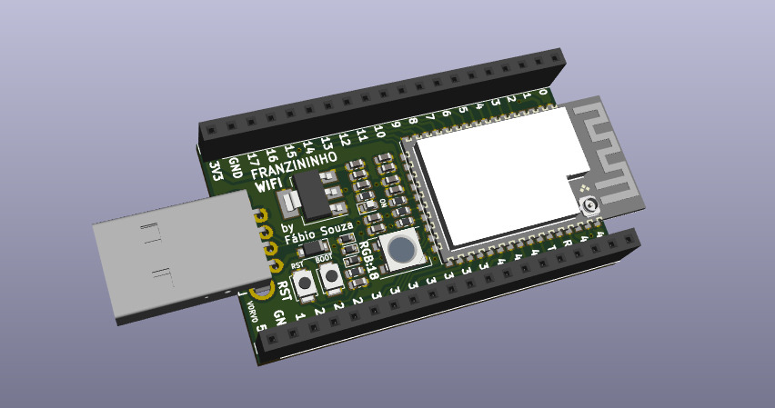
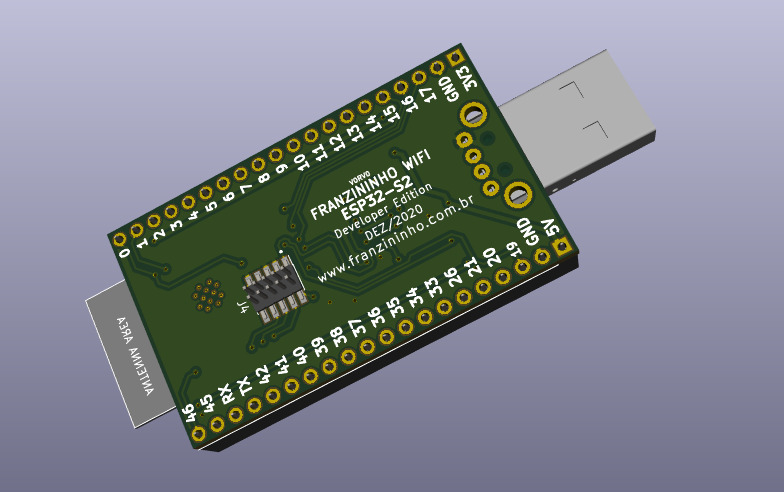
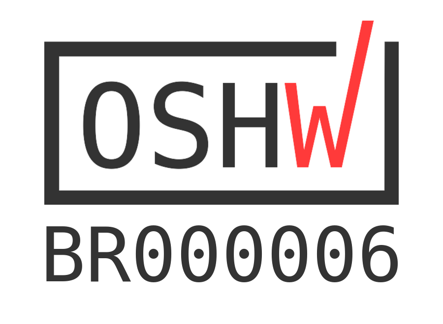

# Franzininho WiFi

A **Franzininho WiFi** é uma placa de desenvolvimento projetada para avaliar os módulos **ESP32-S2** (WROOM e WROVER) e apoiar a criação da nova geração de placas Franzininho.

O projeto Franzininho foi criado com o objetivo de desenvolver habilidades em eletrônica e programação, por meio de atividades no formato *DIY* (faça você mesmo) e alinhadas à cultura *maker*, no Brasil.

Como ainda há poucas placas com ESP32-S2 disponíveis no mercado brasileiro, a Franzininho WiFi foi desenvolvida para servir como uma plataforma de desenvolvimento baseada nesse SoC, além de auxiliar na avaliação e validação de aplicações.

---

## Características

### Módulo ESP32-S2 (WROOM ou WROVER)
- Microprocessador Xtensa® LX7, 32 bits, single-core, até 240 MHz  
- 128 KB de ROM  
- 320 KB de SRAM  
- 16 KB de SRAM em RTC  
- 2 MB (8 Mbit) de PSRAM (apenas no módulo WROVER)  
- Wi-Fi 802.11 b/g/n  

### Interfaces
- GPIO, SPI, LCD, UART, I2C, I2S  
- Interface para câmera  
- IR, contador de pulsos, PWM para LED  
- TWAI (compatível com ISO 11898-1)  
- USB 1.1 OTG  
- ADC, DAC  
- Sensor de toque  
- Sensor de temperatura  

### Hardware
- Conector USB Tipo-A macho  
- LED RGB (WS2812) (GPIO 18)  
- 40 pinos expostos em headers 2x20 (passo 2,54 mm, 36 GPIOs) — compatível com protoboard  
- Botões de Reset e DFU (BOOT0) para acesso ao bootloader ROM (via USB, sem necessidade de cabo adicional)  
- Pinos de depuração serial (TX e RX)  
- Pads JTAG para depuração avançada  
- LED indicador de alimentação 3,3 V  
- Regulador de 3,3 V  

### Alimentação
- Porta Micro USB (padrão)  
- Pinos 5 V e GND  
- Pinos 3V3 e GND  

### Dimensões
- 72 mm x 30 mm  

### Compatibilidade
- Compatível com [ESP-IDF](https://docs.espressif.com/projects/esp-idf/en/latest/esp32s2/get-started/index.html)  
- Compatível com [CircuitPython](https://circuitpython.org/)  

---

## Licença

Este projeto é um hardware de código aberto e está disponível sob a licença **CERN Open Hardware License**.

A placa Franzininho WiFi é certificada pela OSHWA:  
[UID BR000006](https://certification.oshwa.org/br000006.html)

